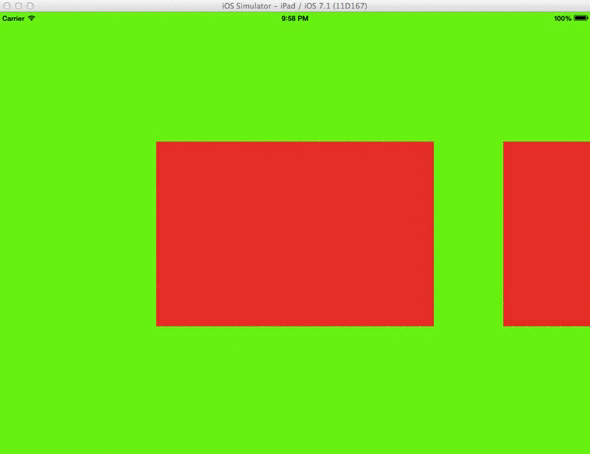

Carousel Collection View layout
===============================

Simple and completely contained `UICollectionViewLayout` subclass that enables paging within collection view. Benefits above just turning on `pagingEnabled` is that your items can have sizes smaller than whole width of your collection (aka it snaps scroll position to center each item, see below).

Layout is automatically adjusted after rotation (or any bounds change) and currently centered item stays centered.

This is also an example of a completely custom `UICollectionViewLayout` subclass.



## Usage

```
@interface CarouselCollectionViewLayout : UICollectionViewLayout

@property(nonatomic) CGSize itemSize;

@property(nonatomic) CGFloat interItemSpace;

@property(nonatomic) CGSize headerSize;

@end
```

Just instantiate `PBDCarouselCollectionViewLayout` instance and set its `itemSize` (which defines size of each item) and `interItemSpace` (which defines spacing between items).

You can also optionally set `headerSize` to a non-`CGSizeZero` value which will cause a header to appear. Please use `PBDCollectionElementKindSectionHeader` identifier to register header supplementary view classes / nibs. 

Right now you can only select horizontal scrolling.
